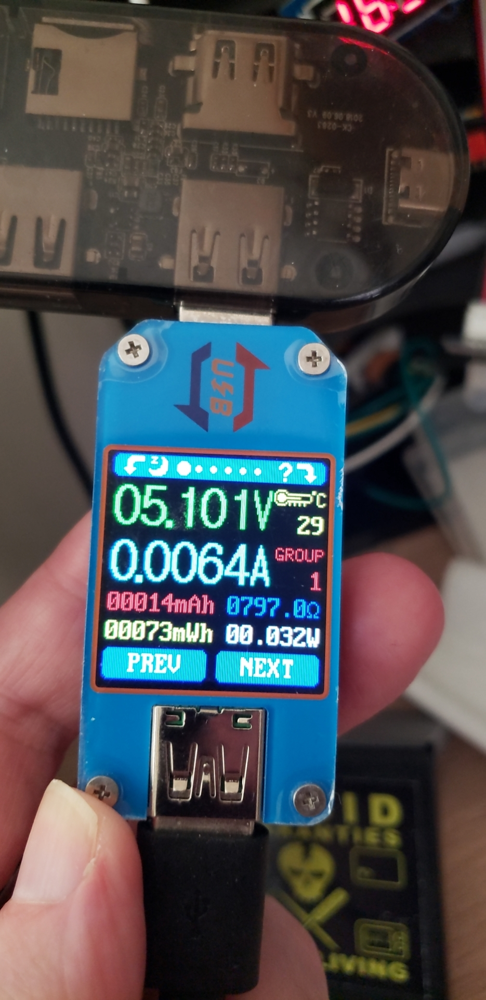

# BastWAN_Sleep

This sketch uses the Arduino Low Power to test power consumption on the BastWAN, by going to extremes: pump out a loud LoRa packet, then go to sleep. The results show on my MacBook Pro and little Ruicheng USB Meter 0.0063-64A.

